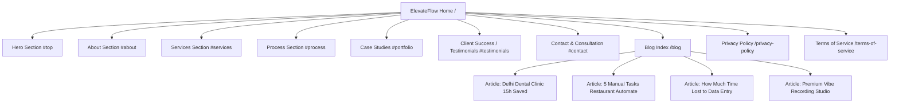

# ElevateFlow Content Audit

## 1. Website Overview

* **Website URL**: `https://elevateflow.in/`
* **Page Title (Homepage)**: `ElevateFlow | Expert Website Developer - Pay Only If You Love It`
* **Meta Description**: None specified / blank in raw metadata.
* **Hosting & Technology**: Hosted on Netlify (with reference to Vercel/Netlify in legal policies), Google Fonts, custom CSS/JS with preloader animation, WhatsApp direct integration widgets, responsive single-page architecture with separate `/blog` and legal routes (`/privacy-policy`, `/terms-of-service`).
* **Visual Identity & Theme**: Dark studio theme (rich blacks, charcoal background surfaces, neon purple accents), glassmorphic notification pills/cards, clean Sans typography, minimalist badges and icon cards.
* **Core Philosophy / Primary Offer**: "Put your business on Autopilot" coupled with a zero-risk guarantee: "No credit card required. Pay only if you love it."

---

## 2. Site Map

* **Live Navigation Structure**:
  * Top Navigation Bar: `About` (`#about`), `Services` (`#services`), `Process` (`#process`), `Portfolio` (`#portfolio`), `Blog` (`/blog`), CTA button `Free Consultation` (`#contact`).
  * Direct URL paths like `/services`, `/about`, `/case-studies`, `/contact` return **404 Not Found** on the live server; navigation relies on single-page hash anchors on the homepage.
  * Standalone Sub-routes:
    * `/blog` (Index of 4 articles)
    * `/blog/how-we-saved-a-delhi-dental-clinic-15-hours-a-week`
    * `/blog/5-manual-tasks-your-restaurant-needs-to-automate-today`
    * `/blog/how-much-time-do-you-actually-lose-to-data-entry`
    * `/blog/designing-a-premium-vibe-for-a-recording-studio`
    * `/privacy-policy`
    * `/terms-of-service`

---

## 3. Complete Content Inventory

### Homepage

#### Header / Navigation
* **Logo**: `ElevateFlow` (stylized split logo)
* **Nav Links**: `About`, `Services`, `Process`, `Portfolio`, `Blog`
* **Action**: `Free Consultation` (Button anchor to `#contact`)

#### Hero Section
* **Status Badge**: `Now accepting new clients`
* **Hero Headline**: `Put your business on Autopilot.`
* **Hero Subheadline**: `We architect high-octane websites, intelligent WhatsApp automations, and self-driving booking systems that capture every lead, slash your manual workload, and scale your revenue while you sleep.`
* **Primary CTA**: `Start Growing Free` (Anchor to `#contact`)
* **Secondary CTA**: `See Case Studies` (Anchor to `#portfolio`)
* **Risk Reversal Microcopy**: `No credit card required. Pay only if you love it.`
* **Interactive Floating Badges & Mock UI**:
  * Chat notification:
    * Sender: `Automated Assistant` (Status: `Online`)
    * Message: `Check out our product page! -> Let's Go!`
    * Message: `How much does it cost? -> We offer tailored plans for every business. -> View Pricing`
  * Stat Badge: `New Booking Confirmed`
  * Stat Badge: `Time Saved: 14 Hours/week`

#### About Section
* **Eyebrow**: `About Elevateflow`
* **Headline**: `We solve your biggest business headaches.`
* **Body Copy**: `I help business owners fix what's broken in their daily operations. Whether you're a doctor tired of no-shows, a restaurant owner dealing with chaotic orders, or a business drowning in admin work – I build tools that actually work for you.`
* **Mission Sub-block**:
  * Label: `My Mission`
  * Text: `To make running your business easier by giving you tools tailored to your exact needs, without the confusing tech jargon.`

#### Services Section (9 Offerings)
* **Eyebrow**: `Our Services`
* **Headline**: `Tools built for your everyday problems.`
* **Subtitle**: `We build simple solutions designed specifically for how you run your business – no forced templates.`
* **Cards**:
  1. **Websites** (🚀) — *High-Conversion Websites*: "Stop losing website visitors. We build high-speed digital front doors designed to capture leads, rank locally, and build immediate trust."
  2. **Communication** (💬) — *Automated Customer Chat*: "Never miss a lead. We set up automated WhatsApp workflows to answer FAQs, pre-qualify leads, and book clients 24/7 without you lifting a finger."
  3. **Booking** (📅) — *Smart Appointment Systems*: "Let clients book their own appointments online, complete with automatic SMS/WhatsApp reminders and upfront deposit collection to reduce no-shows."
  4. **CRM** (🧲) — *Lead Capture & CRM Routing*: "Stop losing leads from IndiaMart or Facebook in a messy inbox. We integrate webhooks to route them directly to your CRM or Google Sheets."
  5. **Automation** (⚙️) — *Business Process Automation*: "Stop paying for manual data entry. We automate data transfer between your emails, spreadsheets, and accounting software."
  6. **Data** (📊) — *Operational Dashboards*: "See your daily metrics, sales, and KPIs at a glance in real-time. We deploy custom dashboards to help you run your business efficiently."
  7. **Healthcare** (🩺) — *Clinic Management Systems*: "Get rid of paper files. Track patients, handle billing, and drastically reduce no-shows with automated reminders tailored for clinics."
  8. **Restaurants** (🍔) — *Restaurant Ordering Systems*: "Bypass aggregator commissions. We build QR code menus and direct-to-kitchen ordering so you keep 100% of your margins."
  9. **Growth** (🔍) — *SEO & Local Marketing*: "Stop being invisible online. We optimize your digital presence so high-net-worth clients find you first when they search locally."
* **In-Section Mid-Funnel CTA**:
  * Heading: `Ready to save time and grow your business?`
  * Subtext: `Stop wasting hours on manual tasks or struggling with generic software. Let's build exactly what you need.`
  * Button: `Book a Free Consultation`

#### Process Section (3-Step Framework)
* **Eyebrow**: `Our Process`
* **Headline**: `We do the heavy lifting, you get the results.`
* **Subtitle**: `You run your business; we handle the tech. Our process is designed to take up as little of your time as possible while building a system that saves you hours every week.`
* **Step 1**: `1. The "Tell Me Your Problems" Call`
  * Description: "We hop on a quick 15-minute call. No tech talk. You just tell me what tasks are wasting your time, where you're losing money, or what's frustrating your staff."
* **Step 2**: `2. We Build The Solution`
  * Description: "You go back to running your business. My team goes to work building a custom tool to solve your exact problems. We handle all the complicated stuff behind the scenes."
* **Step 3**: `3. Handover & Results`
  * Description: "We hand over a ready-to-use system that actually works. We'll show you and your staff exactly how to use it in plain English. From day one, you start saving hours of manual work."

#### Case Studies Section
* **Eyebrow**: `Case Studies`
* **Headline**: `Real solutions. Real results.`
* **Case Study 1 (Healthcare)**:
  * Title: `Smart Clinic Solution`
  * Client: `Dr. Rajesh Kumar`
  * Description: "Replaced paper files with a simple online booking system, complete with automated patient reminders to stop no-shows."
  * Result: `40% reduction in no-shows, 15 hours/week saved for clinic staff.`
* **Case Study 2 (Hospitality)**:
  * Title: `Digital Menu & Ordering`
  * Client: `Sneha's Restaurant`
  * Description: "Set up a QR code menu and direct-to-kitchen ordering system so waitstaff can focus entirely on serving customers."
  * Result: `30% faster table turnover, 20% increase in average order value.`
* **Case Study 3 (B2B Service)**:
  * Title: `Automated Invoicing`
  * Client: `Amit's Business`
  * Description: "Built a tool that automatically creates invoices, chases late payments, and checks the bank so the owner doesn't have to."
  * Result: `15 hours of manual work saved per month, 50% faster payment collection.`
* **Case Study 4 (Creative Industry)**:
  * Title: `Premium Studio Web Presence`
  * Client: `Premium Recording Studio`
  * Description: "Designed a premium, high-conversion website for a top Delhi recording studio to attract high-end artists and increase session bookings."
  * Result: `Sleek, fast-loading digital experience that perfectly matches their premium studio vibe.`

#### Client Testimonials Section
* **Eyebrow**: `Client Success`
* **Headline**: `Don't just take my word for it.`
* **Testimonial 1**:
  * Quote: *"Elevateflow built a patient portal for my clinic. Now my patients can book appointments online and get automated reminders. My staff saves 10+ hours a week."*
  * Attribution: `Dr. Rajesh Kumar`, `Cardiologist` (Initials Avatar: `RK`)
* **Testimonial 2**:
  * Quote: *"The QR code menu and online ordering system increased my table turnover by 30%. I wish I had done this sooner."*
  * Attribution: `Sneha Patel`, `Restaurant Owner` (Initials Avatar: `SP`)
* **Testimonial 3**:
  * Quote: *"ElevateFlow completely transformed our digital presence. The new website perfectly captures our premium vibe and the integrated booking has streamlined our sessions."*
  * Attribution: `Rajneesh Rana`, `Founder, Studio.wav` (Initials Avatar: `RR`)

#### Contact / Lead Capture Section
* **Headline**: `Let's fix your business.`
* **Subtitle**: `Schedule a free chat. Tell us what's slowing your business down, and we'll tell you if we can fix it.`
* **Direct Contact Channels**:
  * Email: `hello@elevateflow.in`
  * Website: `elevateflow.in`
  * WhatsApp Phone: `+91 85277 38145`
* **Lead Capture Form Fields**:
  1. `Full Name` (Text input)
  2. `Work Email` (Email input)
  3. `Business Type / Industry` (Text input)
  4. `What is your biggest bottleneck right now?` (Textarea input)
* **Form Submission CTA**: `Submit Request`
* **Assurance**: `We respect your privacy. No spam, ever.`

#### Footer & Floating Elements
* **Floating Widget**: `Chat on WhatsApp` (sticky bubble linked to `https://wa.me/918527738145`)
* **Legal Navigation**: `PRIVACY POLICY`, `TERMS OF SERVICE`
* **Copyright**: `© 2026 ELEVATEFLOW. ALL RIGHTS RESERVED.`

---

### Blog & Subpages

#### Blog Directory (`/blog`)
* **Title**: `Insights | The ElevateFlow Blog`
* **Tagline**: `Actionable advice, case studies, and guides on how to automate your business processes, save time, and increase revenue without learning to code.`
* **Article 1**:
  * Category: `Case Study | Healthcare Automation`
  * Title: *How We Saved a Delhi Dental Clinic 15 Hours a Week*
  * Key Details: Clinic in South Delhi with 2 receptionists, 20% no-show rate, replaced with automated WhatsApp 24/7 calendar booking, 24-hour reminder nudge, 98% WhatsApp open rate, recovered ₹80,000 lost revenue in 30 days, 40% no-show drop.
* **Article 2**:
  * Category: `Guide | Restaurant Operations`
  * Title: *5 Manual Tasks Your Restaurant Needs to Automate Today*
  * Key Details: QR code ordering (25-35% higher AOV), POS inventory sync (20-30% food waste reduction), WhatsApp reservation bots (handles 84% of calls), AI scheduling, and POS-to-accounting reconciliation.
* **Article 3**:
  * Category: `ROI Analysis | Business Strategy`
  * Title: *How Much Time Do You Actually Lose to Data Entry?*
  * Key Details: Data entry error rate 1-4%, the 1-10-100 error cost rule ($1 verify, $10 correct, $100 failure), B2B invoice case study (500 invoices x 5 min = 41 hours/mo saved).
* **Article 4**:
  * Category: `Showcase | Creative Industry`
  * Title: *Designing a Premium Vibe for a Recording Studio*
  * Key Details: Studio in Safdarjung Enclave, New Delhi (artists: Samayak Prasana, Taimour Baig), audio visualizer preloader, in-browser audio player, `RecordingStudio` JSON-LD schema, WhatsApp lead generation.

#### Legal Documents
* **Privacy Policy (`/privacy-policy`)**:
  * Last updated: July 17, 2026
  * Indian governing law with exclusive jurisdiction in New Delhi courts.
  * Identifies third-party processors: Netlify, Vercel, Razorpay, PayU, Google Analytics, Slack, Zoom.
* **Terms of Service (`/terms-of-service`)**:
  * Scope: Custom web development, SaaS development, AI-powered solutions, workflow automation, and consulting.
  * Clear disclaimers stating no revenue or ranking guarantees are given, with standard 12-month fee cap liability.

---

## 4. Business Model

### Factual Evidence from Website:
1. **Service Type**: Project-based and bespoke solution delivery. Combines custom web development with workflow automation (WhatsApp, CRM webhooks, POS integrations).
2. **Pricing Structure**:
   * Stated as "tailored plans for every business" (via hero assistant dialog).
   * Exact price figures are omitted from the public pages.
3. **Risk-Reversal Model**: "Pay Only If You Love It" / "No credit card required. Start Growing Free."
4. **Sales Mechanism**: 15-minute discovery consultation ("Tell Me Your Problems Call") -> Custom build -> Plain-English handover. Leads captured via form or direct WhatsApp.

### Interpretation / Deductions:
* Operates as a hybrid **Boutique Agency / Solopreneur Consultancy** with an execution team ("I help business owners..." paired with "My team goes to work building a custom tool...").
* Uses a high-trust, low-friction initial hook (pay-on-satisfaction / free initial consultation) to overcome client hesitation among small and local business owners.

---

## 5. Target Customers

Based strictly on explicit mentions and client case studies:

1. **Healthcare Practitioners & Clinics**:
   * Solo doctors, dentists, cardiologists, and local clinics (e.g., Dr. Rajesh Kumar, South Delhi dental clinic).
   * Pain point: Manual appointment booking, phone tag, front desk chaos, and patient no-shows.
2. **Restaurants & Hospitality Businesses**:
   * Independent restaurant owners and managers (e.g., Sneha Patel / Sneha's Restaurant).
   * Pain point: High third-party aggregator commissions, slow table turnover, manual order taking, and inventory waste.
3. **B2B Service Businesses & SMEs**:
   * Small business owners managing high invoice volumes or leads from portals like IndiaMart and Facebook (e.g., "Amit's Business").
   * Pain point: Repetitive data entry, overdue invoices, and disconnected software tools.
4. **Creative & High-End Boutique Businesses**:
   * Recording studios, production houses, and creative agencies (e.g., Studio.wav in Safdarjung Enclave, New Delhi).
   * Pain point: Cheap-looking web presence that fails to communicate premium pricing or artist prestige.

---

## 6. Problems Solved

1. **Revenue Leakage from Patient / Client No-Shows**: Addressed with automated SMS/WhatsApp reminders and deposit workflows.
2. **High Aggregator Fees**: Addressed with direct QR code menus and direct-to-kitchen ordering systems.
3. **Lost Leads from Slow Response Times**: Addressed with 24/7 AI-driven WhatsApp bots and CRM routing.
4. **Wasted Hours on Data Entry & Admin**: Addressed by syncing forms, emails, spreadsheets, and accounting software.
5. **Slow Payment Cycles**: Addressed with automated invoice creation and payment chasing systems.
6. **Mismatched Digital Brand Perception**: Addressed with bespoke, high-conversion modern websites.

---

## 7. Services Matrix

| Service Offering | Core Value / Problem Addressed | Mentioned Deliverables |
| :--- | :--- | :--- |
| **High-Conversion Websites** | Low conversion, poor first impressions | Fast digital front doors, local SEO, mobile-optimized UI |
| **Automated Customer Chat** | Missed after-hours leads, slow response | WhatsApp bots, 24/7 FAQ answers, lead qualification |
| **Smart Appointment Systems** | Front-desk phone bottlenecks, no-shows | Online booking links, WhatsApp/SMS reminders, deposits |
| **Lead Capture & CRM Routing** | Unorganized IndiaMart/Facebook leads | Webhook integrations, Google Sheets sync, CRM pipelines |
| **Business Process Automation** | Costly manual data transfer | API integrations, invoice triggers, email-to-sheet sync |
| **Operational Dashboards** | Lack of visibility into daily metrics | Real-time KPI dashboards, sales/metric monitors |
| **Clinic Management Systems** | Paper file clutter, clinic inefficiency | Digital patient records, billing, appointment workflows |
| **Restaurant Ordering Systems**| Aggregator commissions (Zomato/Swiggy)| QR code menu, direct kitchen ordering, table turnover |
| **SEO & Local Marketing** | Digital invisibility in local searches | Local Google business optimization, JSON-LD schema |

---

## 8. Outcomes / Value Propositions

* **"Put your business on Autopilot."**
* **"Slash your manual workload, and scale your revenue while you sleep."**
* **"We do the heavy lifting, you get the results."**
* **"Tools tailored to your exact needs, without the confusing tech jargon."**
* **"Pay only if you love it. No credit card required."**
* **"From day one, you start saving hours of manual work."**

---

## 9. Proof & Social Proof

* **Named Testimonials (3)**:
  * **Dr. Rajesh Kumar** (Cardiologist): Verified portal development, 10+ hours saved weekly.
  * **Sneha Patel** (Restaurant Owner): 30% increase in table turnover from QR code ordering.
  * **Rajneesh Rana** (Founder, Studio.wav): Brand transformation and streamlined studio booking.
* **Documented Case Studies (4)**:
  * Healthcare (Dr. Rajesh Kumar)
  * Hospitality (Sneha's Restaurant)
  * B2B Service (Amit's Business)
  * Creative (Studio.wav / Premium Recording Studio in Safdarjung Enclave)
* **Blog Deep Dives**: 4 in-depth articles providing breakdowns of business operations and technical solutions.

---

## 10. Quantitative Claims Audit

* `40% reduction in no-shows` (Dr. Rajesh Kumar / Dental Clinic)
* `15 hours/week saved for clinic staff` (Clinic Case Study)
* `14 Hours/week` (Hero badge statistic)
* `30% faster table turnover` (Sneha's Restaurant)
* `20% increase in average order value` (Sneha's Restaurant / Blog QR Guide)
* `15 hours of manual work saved per month` (Amit's Business)
* `50% faster payment collection` (Amit's Business)
* `₹80,000 recovered in previously lost revenue in first month` (Clinic Blog Case Study)
* `98% WhatsApp open rate` (Blog claim)
* `84% incoming calls handled without human intervention` (Blog claim)
* `20-30% reduction in food waste` (Blog claim)
* `22% reduction in staff overscheduling` (Blog claim)

---

## 11. Existing CTAs

1. **Header**: `Free Consultation` (Anchor to contact form)
2. **Hero Primary**: `Start Growing Free` (Anchor to contact form)
3. **Hero Secondary**: `See Case Studies` (Anchor to portfolio)
4. **Hero Risk Reversal**: `No credit card required. Pay only if you love it.`
5. **Services Section Mid-Banner**: `Book a Free Consultation`
6. **Contact Section Form**: `Submit Request`
7. **Floating & Sticky**: `Chat on WhatsApp` (Direct WhatsApp link to `+91 85277 38145`)

---

## 12. Current Positioning

* **Primary Category**: **SME Operational Automation & High-Conversion Web Studio**.
* **Unique Angle**: Solves real operational bottlenecks for non-technical small business owners (doctors, restaurateurs, service businesses) using pragmatic tools (WhatsApp bots, QR menus, CRM webhooks) paired with high-performance web development.
* **Risk Angle**: Extreme risk reversal ("Pay only if you love it", "Start Growing Free").

---

## 13. Content Problems Identified

1. **Page Title Dissonance**: Title says *"Expert Website Developer - Pay Only If You Love It"*, which reduces the company to an individual freelancer building basic websites, while the actual content and services focus heavily on multi-platform business automation, CRM routing, clinic systems, and WhatsApp bots.
2. **Missing Standalone Routing**: Clicking navigation items or seeking deep links for `/services` or `/case-studies` leads to 404 errors if accessed directly via URL, relying purely on single-page scrolling.
3. **Vague Pricing**: Assistant pill says "View Pricing" and "We offer tailored plans", but clicking it does not reveal a pricing table or transparent cost bracket.
4. **Generic Stock Placeholders for Avatars**: Testimonials use two-letter initials (`RK`, `SP`, `RR`) rather than actual photography or verified company logos.
5. **Client Identification Variance**: Amit's business is vaguely called "Amit's Business", Sneha's is called "Sneha's Restaurant", whereas Studio.wav is named specifically in the blog and testimonial.

---

## 14. Messaging Inconsistencies

* **Pronoun Flips**:
  * In Hero: *"We architect high-octane websites..."*
  * In About: *"I help business owners fix what's broken..."* and *"My Mission: To make running your business easier..."*
  * In Process: *"You just tell me..."* followed immediately by *"My team goes to work..."* and *"We hand over a ready-to-use system..."*
  * In Testimonial headline: *"Don't just take my word for it."*
  * In Contact section: *"Tell us what's slowing your business down, and we'll tell you if we can fix it."*
* **Agency vs. Solo Practitioner Identity**: Oscillates between an agency ("ElevateFlow", "We", "My team") and an individual consultant ("I", "My Mission", "tell me").

---

## 15. Important Content We Must Preserve

1. **The Core Promise**: "Put your business on Autopilot" / "Slash manual workload and scale revenue".
2. **The "Pay Only If You Love It" Guarantee**: High-converting risk-reversal hook.
3. **The 3 Key Vertical Examples**: Healthcare/Clinics, Hospitality/Restaurants, and Creative/Studios.
4. **Concrete Quantitative Results**:
   * 40% reduction in no-shows
   * 15 hours/week saved
   * 30% faster table turnover & 20% higher AOV
   * 50% faster invoice collection
5. **Practical WhatsApp Integration Focus**: Crucial differentiator for Indian and emerging markets.
6. **Direct Contact Data**: `hello@elevateflow.in`, `+91 85277 38145`.
7. **Simple 3-Step Process**: "Tell Me Your Problems", "We Build The Solution", "Handover & Results".

---

## 16. Content That Could Potentially Be Removed or Streamlined

1. **"Amit's Business" Case Study**: Too vague; can be rewritten into a concrete B2B Workflow Automation case study with clearer branding.
2. **"Now accepting new clients"**: Can feel like generic agency boilerplate if not paired with real scarcity or booking calendar.
3. **Confusing Floating Pill Chat**: The floating mockup chat in the hero ("Check out our product page! / Let's Go!") feels like a template artifact rather than a real conversion tool.
4. **Repetitive "Book a Free Consultation" Mid-Banners**: Can be consolidated with smoother section-by-section narrative progression.

---

## 17. Open Questions / Information Not Found

1. **Founder Identity**: Who is the "I" behind ElevateFlow? Adding a name, photo, and title (e.g., Founder / Lead Solutions Architect) will dramatically increase credibility if the first-person voice is retained.
2. **Clear Pricing Model / Starting Rates**: While the policy is "Pay only if you love it", does ElevateFlow offer package tiers (e.g., Starter Automation, Full Business OS) or strictly custom quotes?
3. **Client Assets**: Are there live client project screenshots, logos, or domain links for Studio.wav, Dr. Rajesh Kumar's clinic, or Sneha's restaurant that can replace the placeholder avatars?
4. **Target Market Focus**: Is ElevateFlow targeting local Indian businesses specifically (as evidenced by WhatsApp workflows, IndiaMart integration, ₹ figures, New Delhi jurisdiction), or international clients as well?
