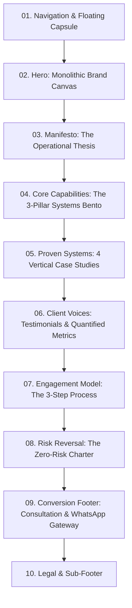
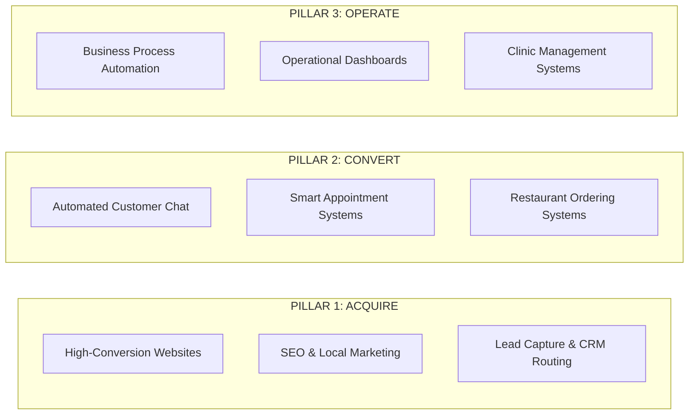

# ElevateFlow Landing Page Strategy & Content Architecture

---

## 1. Positioning

The existing website header describes ElevateFlow as:  
> *"Expert Website Developer - Pay Only If You Love It"*

This framing undersells the business. It traps ElevateFlow in the low-margin, highly commoditized category of solo freelance web designers, whereas the audited evidence reveals that ElevateFlow actually builds bespoke operational backbones: automated WhatsApp booking pipelines, CRM routing (IndiaMart/Facebook leads), restaurant ordering bypasses, clinic management systems, and automated billing reconciliations.

Below are four viable positioning directions derived strictly from the audited evidence.

---

### Direction 1: The Boutique Digital Systems Studio (Recommended)
* **Positioning Statement**: ElevateFlow is a boutique digital systems studio that architects high-conversion web front doors and automated operational workflows for growing independent businesses.
* **Target Audience**: Ambitious clinic directors, restaurant owners, creative studio founders, and SME operators who have outgrown disconnected tools and manual administration.
* **Main Promise**: We eliminate operational drag and capture every revenue opportunity by joining high-performance websites directly to intelligent backend automations.
* **Supporting Proof**:
  * 40% reduction in patient no-shows + 15 hours/week saved for Dr. Rajesh Kumar (Healthcare).
  * 30% faster table turnover + 20% higher average order value for Sneha's Restaurant (Hospitality).
  * 50% faster payment collection for B2B service operations (Amit's Business).
* **Strength**: Perfectly bridges the visual elegance of the Hirael aesthetic with the practical engineering strength of ElevateFlow. It elevates the brand from "tech vendor" to a respected engineering partner.
* **Potential Weakness**: Requires maintaining a high aesthetic standard across both front-of-house UI and back-of-house workflow diagrams.

---

### Direction 2: The SME Automation & Autopilot Engine
* **Positioning Statement**: ElevateFlow builds custom operational infrastructure that puts daily SME workflows on autopilot—turning manual tasks into automated revenue engines.
* **Target Audience**: Time-starved business owners bogged down by phone calls, spreadsheets, manual invoicing, and staff admin.
* **Main Promise**: Reclaim 15+ hours every week and eliminate human error with custom WhatsApp, CRM, and booking automations tailored to how your business actually runs.
* **Supporting Proof**:
  * 14 hours/week average time saved claim.
  * ₹80,000 in recovered appointment revenue within 30 days for dental clinics.
  * Direct webhook pipelines replacing manual IndiaMart/Facebook lead entry.
* **Strength**: Highly tangible ROI proposition. Directly targets business headaches and owner fatigue.
* **Potential Weakness**: Underemphasizes design, brand perception, and high-end web development capabilities (e.g., Studio.wav case study).

---

### Direction 3: The High-Conversion Growth Infrastructure Agency
* **Positioning Statement**: ElevateFlow engineers end-to-end customer acquisition and booking engines that convert anonymous local traffic into paying clients 24/7.
* **Target Audience**: Local service providers and premium boutiques competing for high-value clients in saturated urban markets.
* **Main Promise**: A unified digital presence that pairs high-speed, conversion-engineered web design with instant WhatsApp conversational sales.
* **Supporting Proof**:
  * Studio.wav high-fidelity web presence attracting top-tier recording artists.
  * 24/7 after-hours lead capture (3–5 new qualified appointments captured weekly between 8 PM and 8 AM).
  * 98% open-rate WhatsApp notification systems.
* **Strength**: Strong appeal to revenue-driven founders who prioritize top-line growth over internal efficiency.
* **Potential Weakness**: Skews heavily toward marketing and front-end design, neglecting deep operational features like clinic records, accounting sync, and inventory tracking.

---

### Direction 4: The Zero-Risk Operations Partner (Outcome-Guaranteed)
* **Positioning Statement**: ElevateFlow is the performance-driven tech partner that builds bespoke business systems with zero financial risk—you only pay if you love the result.
* **Target Audience**: Skeptical small business owners who have been burned by flaky freelance developers or rigid off-the-shelf software subscriptions.
* **Main Promise**: Enterprise-grade custom tools built for your exact bottlenecks, delivered with zero technical jargon and backed by our pay-on-satisfaction guarantee.
* **Supporting Proof**:
  * Explicit live risk-reversal guarantee: *"No credit card required. Pay only if you love it."*
  * 3-step frictionless deployment model ("Tell Me Your Problems", "We Build The Solution", "Handover & Results").
* **Strength**: Extremely high conversion friction-reducer for inbound leads.
* **Potential Weakness**: Positioning primarily on payment terms can attract tire-kickers and undermine authority if not counterbalanced by uncompromising craft.

---

### Selected Direction: Direction 1 — The Boutique Digital Systems Studio
**Rationale**: Direction 1 harmonizes the entire factual footprint of ElevateFlow. It unifies front-end design excellence (Studio.wav) with deep backend workflow automation (Healthcare, Restaurants, B2B invoicing), while providing the ideal intellectual and aesthetic tone for the Hirael Creative Studio template.

---

## 2. Core Message

* **Tone & Persona**: Boutique, authoritative, disciplined, understated luxury, technically sophisticated, human. No corporate buzzwords, no empty "AI revolution" clichés.

### Brand One-Liner
> **"ElevateFlow architects high-conversion web front doors and intelligent operational backbones for growing independent businesses."**

### Hero Headline Options (5 Options)
1. **Boutique Systems Authority**:  
   *`High-performance digital front doors. Self-driving business systems.`*
2. **Outcome & Autopilot (Audited Baseline Refined)**:  
   *`Put your business operations on autopilot.`*
3. **Architectural & Editorial**:  
   *`Engineered for conversion. Built to run without you.`*
4. **Direct Problem/Solution**:  
   *`Where bespoke web craft meets effortless business automation.`*
5. **Bold Typographic (Hirael Monolithic Scale)**:  
   *`Digital architecture for modern business.`*

### Hero Supporting Copy Options (3 Options)
* **Option A (Comprehensive & Rhythmic — Recommended)**:  
  *We design high-speed web presences and build intelligent WhatsApp, booking, and CRM automations that capture every customer, eliminate administrative fatigue, and scale your daily operations.*
* **Option B (Outcome-Centric)**:  
  *Stop losing revenue to missed inquiries, chaotic phone calls, and manual spreadsheets. We build custom digital systems tailored precisely to how your business operates—delivered with zero tech jargon.*
* **Option C (Minimalist & Direct)**:  
  *Bespoke websites and operational workflows engineered to capture demand, automate fulfillment, and give business owners their time back.*

### Primary CTA Options (3 Options)
1. **Recommended**: `Start a Project` (Matches Hirael's button anatomy while remaining actionable)
2. **Low-Friction**: `Schedule Consultation`
3. **Audited Guarantee**: `Start Free — Pay On Results`

### Secondary CTA Options (3 Options)
1. **Recommended**: `Explore Client Systems` (Anchors to Case Studies/Features)
2. **Proof-Focused**: `View Documented Results`
3. **Conversational**: `Chat on WhatsApp`

### Short Positioning Statement
> *For independent clinics, hospitality venues, and growing service firms, ElevateFlow replaces disconnected software and manual admin with unified digital front doors and automated operational backbones.*

### Core Value Propositions (4 Pillars)
1. **Bespoke, Not Template-Bound**: Every workflow, booking engine, and interface is custom-engineered around the client's actual operating model.
2. **Zero Inflow Leakage (24/7 Capture)**: Instant WhatsApp automated routing and online scheduling ensure no client inquiry or after-hours booking is ever dropped.
3. **Radical Admin Reduction**: Automated sync between inquiries, CRMs, invoices, and accounting cuts 10–15 hours of manual drudgery weekly.
4. **Frictionless Engagement (Pay on Love)**: A collaborative delivery model backed by plain-English handover and an uncompromised satisfaction commitment.

---

## 3. Hirael → ElevateFlow Section Mapping

| Hirael Section | Original Hirael Component & Purpose | ElevateFlow Transformation | Content Source (Audit) | Keep / Modify / Remove |
| :--- | :--- | :--- | :--- | :--- |
| **01. Navigation** | Minimalist floating pill with 5 links (`Our story`, `Collective`, `Workshops`, `Programs`, `Inquiries`) | Floating black capsule nav: `About`, `Solutions`, `Systems`, `Results`, `Process`, with CTA button `Consultation` | Homepage navigation header | **Modify** (Keep exact Hirael styling/motion; update links & add direct action) |
| **02. Hero** | Fullscreen 100dvh cinematic video/canvas, giant monolithic title (`Hirael*`), summary text, pill CTA | Fullscreen dark studio canvas with monolithic typographic title `ElevateFlow*`, sub-tagline, brand one-liner, and `Start a Project` CTA | Hero section copy + audited "Put your business on Autopilot" + trust badge | **Modify** (Keep monolithic title, animated noise overlay, and motion layout; adapt copy) |
| **03. Narrative Statement** | `About.tsx` with uppercase badge (`Visual arts`), serif italic mixed header, and scroll-scrub text reveal (`ScrollRevealText`) | Section 03: The ElevateFlow Thesis. Eyebrow: `OPERATIONAL CRAFT`. Headline: *"We solve the silent bottlenecks that cap business growth."* Scroll reveal text focusing on replacing chaos with custom systems. | Homepage "About Elevateflow" + Blog data entry & clinic pain points | **Modify** (Preserve the exact `WordsPullUpMultiStyle` and `ScrollRevealText` components) |
| **04. Solutions Bento Grid** | `Features.tsx` featuring a 4-column card grid (1 ambient card + 3 numbered feature cards with checkmarks & arrows) | Section 04: The 3 Operational Pillars (`01 Acquire`, `02 Convert`, `03 Operate`). Ambient card highlights the bespoke unified ecosystem. | 9 Audited Services consolidated into 3 comprehensive pillars | **Modify** (Keep exact Hirael 4-column bento architecture, icons, and micro-hover states) |
| **05. Systems in Action (Case Studies)** | *(Not in original Hirael v1 single-screen layout; Hirael was 4 sections total)* | Dedicated Systems Gallery / Case Studies card deck displaying verified results across Healthcare, Hospitality, B2B, and Creative. | 4 Audited Case Studies (Dr. Rajesh Kumar, Sneha's Restaurant, Amit's Business, Studio.wav) | **NEW SECTION** (Crafted using Hirael's native design tokens, dark surfaces, and typography) |
| **06. Verified Client Outcomes** | *(Not in original Hirael v1)* | Quotation & Proof showcase featuring verified testimonials with client metrics and attributions. | 3 Audited Testimonials (Cardiologist, Restaurant Owner, Studio Founder) | **NEW SECTION** (Editorial typography using Instrument Serif italics + Almarai) |
| **07. The 3-Step Execution Model** | *(Not in original Hirael v1)* | Interactive 3-step timeline: `01 Discovery Diagnostic`, `02 Bespoke System Build`, `03 Handover & Autopilot`. | 3-step "Our Process" from audit | **NEW SECTION** (Structured minimal timeline honoring Hirael design system) |
| **08. Footer & Engagement Engine** | `Footer.tsx` with mixed-serif headline (*"Let us make something rare."*), pill CTA button, 4 link columns, giant faint background text, and copyright | Eyebrow: `GET IN TOUCH`. Headline: *"Let us put your business on autopilot."* Direct CTA: `Schedule Consultation` + direct WhatsApp link, email, phone, and legal links. | Contact section + footer from live site (`hello@elevateflow.in`, `+91 85277 38145`) | **Modify** (Keep exact Hirael footer layout, giant faint `ElevateFlow` watermark, and link grid) |

---

## 4. Proposed Final Landing Page Architecture

The redesigned page follows a strict editorial conversion arc:
$$\text{ATTENTION} \longrightarrow \text{UNDERSTANDING} \longrightarrow \text{PROBLEM} \longrightarrow \text{SOLUTION} \longrightarrow \text{PROOF} \longrightarrow \text{TRUST} \longrightarrow \text{ACTION}$$



### Detailed Section Breakdown

#### Section 01 — Navigation (Floating Capsule)
* **Purpose**: Quiet, fixed navigational orientation without viewport distraction.
* **Content**:
  * Brand mark: `ElevateFlow`
  * Links: `About`, `Solutions`, `Systems`, `Results`, `Process`
  * Action: `Consultation`
* **Motion**: Centered fixed positioning, subtle backdrop blur, smooth hover color shifts.

#### Section 02 — Hero Canvas (Attention)
* **Purpose**: Immediate command of visual authority; communicates premium systems focus.
* **Main Message**: ElevateFlow builds high-octane websites and automated business backbones.
* **Headline**:  
  *`ElevateFlow*`* (Monolithic 18vw display font via `WordsPullUp`)
* **Supporting Copy**:  
  *We architect high-conversion digital front doors, intelligent WhatsApp automations, and self-driving booking systems that capture every lead and scale your business without operational drag.*
* **CTAs**: Primary `Start a Project` $\rightarrow$ Anchor `#contact`; Secondary `Explore Systems` $\rightarrow$ Anchor `#systems`.
* **Trust Chip**: `No credit card required. Pay only if you love it.`
* **Motion**: Atmospheric noise overlay + ambient animated radiant gradient canvas (`CinematicBackground variant="hero"`).

#### Section 03 — Manifesto / The Operational Thesis (Understanding)
* **Purpose**: Educates the client on why off-the-shelf software and generic websites fail.
* **Eyebrow**: `OPERATIONAL ARCHITECTURE`
* **Headline (Mixed Style)**:  
  *`We solve the silent bottlenecks`* *(normal font)*  
  *`that stall business growth.`* *(Instrument Serif Italic)*
* **Supporting Copy (Scroll Scrub Reveal)**:  
  *Most businesses do not have a traffic problem—they have a systems bottleneck. They lose qualified leads to delayed WhatsApp responses, waste 15 hours every week on manual data entry, and lose patients or diners to missed phone calls. We replace manual friction with custom tools engineered around your daily reality.*
* **Motion**: Character-by-character scroll scrub reveal (`ScrollRevealText`).

#### Section 04 — Core Solutions Bento (Solution)
* **Purpose**: Showcase capabilities without drowning the reader in 9 separate commodity cards.
* **Main Message**: Complete operational coverage structured into 3 clear domains.
* **Headline**: `Engineered systems for daily operations.`
* **Bento Architecture (4 Columns matching Hirael `Features.tsx`)**:
  * **Card 1 (Visual Ambient Canvas)**: *“Bespoke Digital Infrastructure”* with animated gradient glow.
  * **Card 2 (01 / ACQUIRE)**: *High-Conversion Web & SEO*. Deliverables: High-speed front doors, local SEO schema, 24/7 lead capture.
  * **Card 3 (02 / ENGAGE)**: *Conversational WhatsApp & Booking*. Deliverables: Smart WhatsApp bots, calendar booking, automated SMS/WhatsApp reminders, deposit collection.
  * **Card 4 (03 / SCALE)**: *Workflow & Back-Office Automation*. Deliverables: CRM webhook routing (IndiaMart/FB), invoice reconciliation, real-time KPI dashboards.
* **Motion**: Staggered scroll-triggered fade/scale up (`FeatureCard` with `EASE_CARD`).

#### Section 05 — Proven Systems in Action (Proof)
* **Purpose**: Demonstrates tangible, battle-tested solutions with industry-specific authority.
* **Eyebrow**: `SELECTED WORK`
* **Headline**: `Real systems. Quantified business outcomes.`
* **Cards / Showcases (4 Vertical Case Studies)**:
  1. **Healthcare / Clinic Operations** (Dr. Rajesh Kumar)  
     *Headline*: Automated WhatsApp Booking & No-Show Shield  
     *Metric*: `40% reduction in no-shows` | `15 hours/week saved`
  2. **Hospitality & Dining** (Sneha's Restaurant)  
     *Headline*: QR Menu & Direct Kitchen Ordering Architecture  
     *Metric*: `30% faster table turnover` | `20% higher order value`
  3. **B2B Service Infrastructure** (Amit's Business / Enterprise Ops)  
     *Headline*: Automated Invoicing & Payment Reconciliation Flow  
     *Metric*: `50% faster collection` | `15 hours/month saved`
  4. **Creative Industry Studio** (Studio.wav — Safdarjung Enclave, New Delhi)  
     *Headline*: High-Fidelity Studio Web Presence & Session Engine  
     *Outcome*: Dark aesthetic, integrated audio player, and instant session reservation.
* **Motion**: Card elevation and subtle border glow on hover.

#### Section 06 — Client Voices (Trust)
* **Purpose**: Social proof from actual practitioners.
* **Eyebrow**: `TESTIMONIALS`
* **Headline**: `Endorsed by operators who value their time.`
* **Testimonials**:
  * *“ElevateFlow built a patient portal for my clinic. Patients book directly via WhatsApp, and automated reminders cut our cancellations in half. My staff reclaimed 10+ hours every week.”* — **Dr. Rajesh Kumar**, Cardiologist.
  * *“The QR code ordering system completely bypassed aggregator bottlenecks. Our table turnover jumped by 30% from the first weekend.”* — **Sneha Patel**, Restaurant Owner.
  * *“Our new web presence completely transformed our digital stature. It captures the high-end studio aesthetic and has made artist bookings effortless.”* — **Rajneesh Rana**, Founder, Studio.wav.
* **Visual Presentation**: Refined quote layout with subtle avatars and verified domain badges.

#### Section 07 — The 3-Step Engagement Framework (Process)
* **Purpose**: Demystifies engagement and shows how little effort is demanded of the business owner.
* **Eyebrow**: `HOW WE WORK`
* **Headline**: `From bottleneck diagnosis to self-driving system.`
* **Steps**:
  * **Phase 01 — Bottleneck Diagnostic (15 Min)**: A candid discussion on where hours and leads are currently leaking. No technical jargon.
  * **Phase 02 — Custom System Engineering**: While you run your business, we build your tailored web front door and automation flows.
  * **Phase 03 — Plain-English Handover**: We train your staff, deploy the system, and confirm tangible time savings from day one.
* **Motion**: Horizontal progressive disclosure or clean 3-column minimalist layout.

#### Section 08 — Risk Reversal Charter (Reassurance)
* **Purpose**: Removes remaining purchase anxiety.
* **Headline**: `The Zero-Risk Guarantee`
* **Core Copy**:  
  *We believe technology should demonstrate value before demanding commitment. We engineer your system, demonstrate it working in your workflow, and you only pay when you are completely satisfied.*
* **Highlights**: `No Credit Card Required` • `100% Code Ownership` • `Zero Confusing Retainers`

#### Section 09 — Final Conversion Canvas (Action)
* **Purpose**: Captures lead intent with dual paths (in-depth consultation form or instant WhatsApp).
* **Eyebrow**: `START A PROJECT`
* **Headline (Mixed Style)**:  
  *`Let us put your business`* *(normal)*  
  *`on autopilot.`* *(Instrument Serif Italic)*
* **Components**:
  * Form: Name, Work Email, Business Type, Primary Bottleneck, Submit Request button.
  * Quick Contact Card: Email (`hello@elevateflow.in`), WhatsApp (`+91 85277 38145`), New Delhi Studio office.
* **CTA Button**: `Request Diagnostic Call`

#### Section 10 — Sub-Footer & Legal
* **Content**: Giant faint watermark `ElevateFlow`, copyright notice, Privacy Policy link, Terms of Service link.

---

## 5. Services Consolidation Strategy

The audited website lists **9 disconnected service cards**:
1. *High-Conversion Websites*
2. *Automated Customer Chat*
3. *Smart Appointment Systems*
4. *Lead Capture & CRM Routing*
5. *Business Process Automation*
6. *Operational Dashboards*
7. *Clinic Management Systems*
8. *Restaurant Ordering Systems*
9. *SEO & Local Marketing*

Presenting 9 cards creates cognitive overload and feels like an uncurated feature checklist. We consolidate all 9 services into **3 cohesive Solution Pillars**:



### Pillar 1: Acquire — Digital Front Doors & Demand Capture
* **Integrated Services**:
  * *High-Conversion Websites*
  * *SEO & Local Marketing (JSON-LD Local Schema)*
  * *Lead Capture & Webhook Routing (IndiaMart, Meta Ads, Google)*
* **Editorial Angle**: Turning passive local searches and distributed ad leads into structured CRM records immediately.

### Pillar 2: Convert — Conversational Sales & Smart Booking
* **Integrated Services**:
  * *Automated Customer Chat (WhatsApp 24/7 AI)*
  * *Smart Appointment Systems (SMS/WhatsApp reminders + upfront deposits)*
  * *Direct Restaurant Ordering Systems (QR Menus + kitchen routing)*
* **Editorial Angle**: Eliminating missed calls and no-shows by closing bookings in the customer's native messaging environment.

### Pillar 3: Operate — Automated Workflows & Back-Office Sync
* **Integrated Services**:
  * *Business Process Automation (API integrations between spreadsheets, invoices, and accounting)*
  * *Operational Dashboards (Real-time sales, turnover, and volume KPIs)*
  * *Specialized Vertical Systems (Clinic management, paperless patient tracking)*
* **Editorial Angle**: Freeing the business owner and key staff from 15+ hours of repetitive data entry every week.

*No capabilities are lost; all 9 services are given greater contextual weight within a strategic system.*

---

## 6. Case Studies & Proof Presentation

### Verified Claims Matrix (Strictly from Audit)

| Vertical | Client Reference | Problem Identified | Engineered Solution | Documented Outcome |
| :--- | :--- | :--- | :--- | :--- |
| **Healthcare** | **Dr. Rajesh Kumar**, Cardiologist (South Delhi Clinic) | 20% no-show rate, receptionists spending 3 hrs/day on manual phone tag | 24/7 WhatsApp calendar booking + automated 24-hr reminder nudge | **40% reduction in no-shows**<br>**15 hours/week saved** for clinic staff<br>₹80,000 recovered in month one |
| **Hospitality** | **Sneha Patel**, Sneha's Restaurant | High aggregator commissions, slow table turnover, order taking bottlenecks | Table QR code menu with direct-to-kitchen ordering | **30% faster table turnover**<br>**20% increase in average order value (AOV)** |
| **B2B Operations** | **Amit's Business**, B2B Services | 500 invoices/month created manually; 40+ hours lost reconciling spreadsheets | Automated invoice triggers from CRM + bank reconciliation | **50% faster payment collection**<br>**15 hours of manual work saved/month** |
| **Creative Studio** | **Rajneesh Rana**, Founder, Studio.wav (Safdarjung Enclave) | Elite audio facility held back by an outdated, non-converting digital presence | Dark boutique website with built-in audio player and session booking engine | **Premium brand perception**<br>Direct WhatsApp session booking engine |

### Verification Flags Before Public Launch
> [!IMPORTANT]
> **Claims Requiring Confirmation**:
> 1. *₹80,000 recovered revenue*: Audited from blog post; confirm whether this figure is approved for prominent landing page showcase or should remain as "40% reduction in no-shows".
> 2. *Dr. Rajesh Kumar*: Verify whether the client prefers "Dr. Rajesh Kumar, Cardiologist" or "Dental Clinic Director" (both were referenced across homepage and blog).
> 3. *Amit's Business*: Replace generic placeholder name with the client's official entity name or anonymized industry title (e.g., *"National Industrial Logistics Supplier"*).

---

## 7. Process (3-Step Framework)

The audited site has a strong 3-step foundation:
1. *The "Tell Me Your Problems" Call*
2. *We Build The Solution*
3. *Handover & Results*

Here are three naming options ranked by brand maturity:

### Approach A: Conversational & Direct (Preserves exact raw spirit)
1. **The Problem Diagnostic**: *A 15-minute plain-English audit of what is wasting your time.*
2. **The Custom Build**: *We engineer your web front door and automations behind the scenes.*
3. **The Results Handover**: *Plain-English staff walk-through. Real hours saved from day one.*

### Approach B: High-End Boutique Engineering (Recommended)
1. **01 / Diagnostic**: *We map your daily bottlenecks, manual leaks, and lost inquiry points.*
2. **02 / Architecture**: *We engineer bespoke web interfaces and connect automated WhatsApp and CRM flows.*
3. **03 / Deployment**: *Frictionless launch, comprehensive team onboarding, and immediate operational leverage.*

### Approach C: Outcome-Centric
1. **Audit & Scope**: *Identify the 15 hours you lose each week.*
2. **Build & Integrate**: *Custom software without the enterprise price tag.*
3. **Autopilot**: *Your business captures leads and updates records while you sleep.*

---

## 8. CTA Strategy & Hierarchy

The audited website repeated *"Book a Free Consultation"* and *"Free Consultation"* multiple times without contextual differentiation. 

### Unified 4-Tier CTA Architecture

```
[ Tier 1: Navigation Action ]  -----> "Consultation" (Minimal pill button)
[ Tier 2: Hero Primary ]      -----> "Start a Project" (Supported by risk reversal)
[ Tier 3: Contextual Proof ]   -----> "See Case Studies" or "Explore Systems"
[ Tier 4: Final Closing ]      -----> "Schedule Diagnostic Call" + "Chat on WhatsApp"
```

### Strategic Recommendations:
1. **Hero Primary**: Use **`Start a Project`** paired immediately with the microcopy:  
   *`No credit card required. Pay only if you love it.`*  
   *Why*: Avoids sounding like a generic sales pitch while highlighting the signature zero-risk promise.
2. **Hero Secondary**: Use **`Explore Systems`** (Smooth scrolls to Section 04 Bento).
3. **Mid-Page Contextual CTAs**: Instead of inserting abrupt "Book Consultation" banners between sections, use subtle inline link buttons:  
   *`View Healthcare System Details →`* or *`Discuss Your Specific Bottleneck →`*.
4. **Final Closing CTA**: Dual-path approach in Section 09:
   * Path A (Form): `Request Diagnostic Call`
   * Path B (Instant Messaging): `Chat Directly on WhatsApp`

---

## 9. Voice & Pronoun Consistency

### Audit Finding
The current site fluctuates between:
* Solo freelancer: *"I help business owners...", "My Mission...", "tell me your problems"*
* Agency: *"We architect...", "Our Services...", "We solve..."*
* Hybrid ambiguity: *"You tell me... my team goes to work..."*

### Strategic Evaluation:
* **Option A: Pure Solo ("I")**: Can increase personal rapport, but caps perceived scale and conflicts with larger B2B enterprise builds.
* **Option B: Pure Corporate ("We")**: Can sound impersonal and detached if written in corporate jargon.
* **Option C: Boutique Studio Voice ("We", Studio-Led) — RECOMMENDED**:  
  ElevateFlow speaks as a focused, elite engineering studio (*"We architect...", "Our studio..."*). When personal accountability is beneficial (such as in the diagnostic call or risk reversal), it frames it as personal partner stewardship without lapsing into informal solo-freelance language.

### Pronoun Rulebook:
* **Brand Entity**: Always refer to the firm as **`ElevateFlow`** or **`the studio`**.
* **First-Person Plural**: Consistently use **`We`**, **`Our team`**, and **`Our engineers`**.
* **Eliminate**: Purge all isolated instances of *"I"*, *"My Mission"*, and *"tell me"*.
* **Customer Addressing**: Always address the client directly as **`You`** and **`Your business`**.

---

## 10. Visual Content Requirements

To elevate the landing page to Hirael standards, we catalog the required visual assets, strictly delineating what currently exists from what must be created:

### Available from Current Site & Template:
* [x] Hirael monolithic typography and animated letter pull-up components.
* [x] Animated ambient noise overlay and mathematical canvas gradients.
* [x] Core color palette (Charcoal `#070707`, `#101010`, Cream `#E1E0CC`, Ink `#DEDBC8`, Muted Olive-Stone `#8B8A80`).
* [x] 4 complete case study narratives with quantified metrics.
* [x] 3 verified client quotes with names and titles.
* [x] Contact information and WhatsApp direct links.

### Needs to Be Created / Provided:
1. **Interactive Workflow Diagrams (SVG / Mock UI)**:
   * A clean, dark-mode WhatsApp conversational chat UI showing an appointment confirmation and 24-hr reminder prompt.
   * A webhook routing diagram (e.g., *IndiaMart / Facebook Lead $\rightarrow$ ElevateFlow Webhook $\rightarrow$ CRM / Sheets*).
   * A minimal QR code ordering interface for Sneha's Restaurant.
2. **Case Study Visual Assets**:
   * High-fidelity dark mockups of Studio.wav's sleek audio player interface.
   * Dr. Rajesh Kumar's patient booking calendar card mockup.
3. **Client Avatars / Monograms**:
   * Replace plain text letters (`RK`, `SP`, `RR`) with refined typographic studio badges or verified portrait photography.
4. **Interactive Feature Icons**:
   * Custom minimalist SVG icons for the 3 pillars (`Acquire`, `Convert`, `Operate`).

---

## 11. Final Page Blueprint

This blueprint serves as the definitive structural and narrative specification for the upcoming implementation phase:

```
================================================================================
01 — NAVIGATION (Fixed Floating Capsule)
     Mark: ElevateFlow
     Links: About · Solutions · Systems · Results · Process
     Action: Consultation (Pill Button)
--------------------------------------------------------------------------------
02 — HERO (Atmospheric Monolithic Canvas)
     Badge: NOW ACCEPTING SELECT PROJECTS
     Title: ELEVATEFLOW*
     Headline: High-performance digital front doors. Self-driving business systems.
     Support: We architect high-speed web presences, intelligent WhatsApp flows,
              and self-driving booking systems that capture every lead and scale
              your business without operational drag.
     Action: [Start a Project] · [Explore Systems]
     Guarantee: No credit card required. Pay only if you love it.
--------------------------------------------------------------------------------
03 — THE THESIS (Editorial Typography & Scroll Scrub Reveal)
     Eyebrow: OPERATIONAL CRAFT
     Headline: We solve the silent bottlenecks that cap business growth.
     Scroll Body: Most businesses do not have a traffic problem—they have a systems
                  bottleneck. We replace manual friction, missed calls, and data entry
                  with custom tools engineered around your daily reality.
--------------------------------------------------------------------------------
04 — THE SOLUTIONS BENTO (4-Column Native Hirael Architecture)
     Header: Engineered systems for daily operations.
     Card 1: Bespoke Architecture (Ambient Studio Canvas)
     Card 2: 01 / Acquire (Websites · Local SEO · Inbound Lead Webhooks)
     Card 3: 02 / Convert (WhatsApp Automation · Smart Booking · QR Menus)
     Card 4: 03 / Operate (Workflow Automation · Invoicing · Live Dashboards)
--------------------------------------------------------------------------------
05 — CASE STUDIES (Verified Quantified Proof)
     Header: Real systems. Documented outcomes.
     Showcase 1: Healthcare — 40% No-Show Reduction | 15 hrs/wk Saved
     Showcase 2: Hospitality — 30% Faster Turnover | 20% Higher AOV
     Showcase 3: B2B Services — 50% Faster Payment Collection | 15 hrs/mo Saved
     Showcase 4: Creative Studio — High-Fidelity Audio Web Presence & Booking
--------------------------------------------------------------------------------
06 — CLIENT VOICES (Editorial Testimonial Showcase)
     Header: Endorsed by operators who value their time.
     Quote 1: Dr. Rajesh Kumar (Cardiologist, Clinic Director)
     Quote 2: Sneha Patel (Hospitality Founder)
     Quote 3: Rajneesh Rana (Founder, Studio.wav)
--------------------------------------------------------------------------------
07 — THE PROCESS (3-Phase Delivery Framework)
     Header: From bottleneck diagnosis to self-driving system.
     Phase 01: Diagnostic (15-min plain-English operational audit)
     Phase 02: Architecture (Custom engineering of front doors and flows)
     Phase 03: Deployment (Frictionless launch, staff onboarding, instant ROI)
--------------------------------------------------------------------------------
08 — THE RISK REVERSAL CHARTER (Authority & Guarantee)
     Header: The Zero-Risk Commitment.
     Support: Pay only when you are 100% satisfied with the deployed system.
              Full code ownership. Zero locked subscriptions.
--------------------------------------------------------------------------------
09 — ENGAGEMENT ENGINE (Dual-Path Conversion Form & Direct Channels)
     Headline: Let us put your business on autopilot.
     Form: Diagnostic Request (Name, Email, Industry, Core Bottleneck)
     Direct: WhatsApp Hotline (+91 85277 38145) · Email (hello@elevateflow.in)
--------------------------------------------------------------------------------
10 — FOOTER & LEGAL (Native Hirael Monolithic Watermark & Grid)
     Columns: Solutions · Company · Connect · Location (New Delhi, India)
     Watermark: ELEVATEFLOW (22vw Low-Opacity Display)
     Legal: Privacy Policy · Terms of Service · © 2026 ElevateFlow
================================================================================
```
